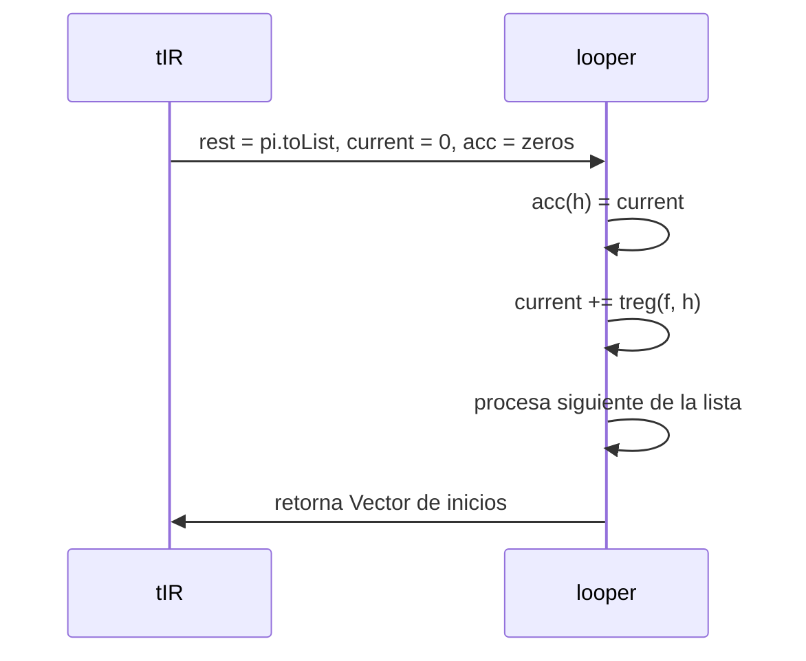

# Informe de Proceso – Programación de Riego

## Introducción

En este taller se modela una finca como un conjunto de tablones con tiempos de supervivencia, tiempos de riego y prioridades, y se buscan programaciones de riego que minimicen el costo total (costo de riego + costo de movilidad). La solución se implementa en Scala usando **programación funcional**: sin variables mutables, sin bucles imperativos, con recursión de cola y colecciones inmutables. También se incluyen versiones paralelas apoyadas en `scala-parallel-collections`.

Tipos principales:

```scala
type Tablon   = (Int, Int, Int)        // (tsupervivencia, tregado, prioridad)
type Finca    = Vector[Tablon]
type Distancia= Vector[Vector[Int]]
type ProgRiego= Vector[Int]            // permutación de índices
type TiempoInicioRiego = Vector[Int]
```

---

## Función `tIR` (tiempos de inicio de riego)

### Abstracción

Dada una programación `pi`, se acumulan los tiempos de riego de cada tablón en el orden de `pi`, y se asigna a cada índice el tiempo en el que comienza.

$$
tIR(f, \pi)[\pi(k)] = \sum_{j=0}^{k-1} tr(\pi(j))
$$

### Implementación (recursión de cola)

```scala
def tIR(f: Finca, pi: ProgRiego): TiempoInicioRiego = {
  val n = f.length
  @tailrec
  def looper(rest: List[Int], current: Int, acc: Vector[Int]): Vector[Int] = rest match {
    case Nil => acc
    case h :: t =>
      val updated = acc.updated(h, current)
      looper(t, current + treg(f, h), updated)
  }
  looper(pi.toList, 0, Vector.fill(n)(0))
}
```

### Pila de llamados (Mermaid)



---

## Funciones de costo

### Costo por tablón

Si el riego termina antes de que venza su supervivencia, penaliza la tardanza; si arranca tarde, penaliza proporcional a la prioridad.

$$
\text{start} = tIR(f,\pi)[i], \quad \text{finish} = \text{start} + tr(i)
$$

$$
\text{costoRiego}(i) =
\begin{cases}
\max(0, ts(i) - \text{finish}), & \text{si } ts(i) - tr(i) \ge \text{start} \\
p(i) \cdot (\text{finish} - ts(i)), & \text{otro caso}
\end{cases}
$$

```scala
def costoRiegoTablon(i: Int, f: Finca, pi: ProgRiego): Int = {
  val t = tIR(f, pi)
  val ts = tsup(f, i); val tr = treg(f, i); val p = prio(f, i)
  val start = t(i); val finish = start + tr
  if (ts - tr >= start) math.max(0, ts - finish) else p * (finish - ts)
}
```

### Costo total de riego y movilidad

```scala
def costoRiegoFinca(f: Finca, pi: ProgRiego): Int =
  f.indices.map(i => costoRiegoTablon(i, f, pi)).sum

def costoMovilidad(f: Finca, pi: ProgRiego, d: Distancia): Int =
  if (pi.length <= 1) 0 else pi.sliding(2).map { case Vector(a, b) => d(a)(b) }.sum
```

---

## Generación de programaciones

Secuencial: todas las permutaciones de 0..n-1.

```scala
def generarProgramacionesRiego(f: Finca): Vector[ProgRiego] = {
  val n = f.length
  Vector.range(0, n).permutations.map(_.toVector).toVector
}
```

Paralelo: misma lógica, materializando en paralelo (cuidado con factorial).

```scala
def generarProgramacionesRiegoPar(f: Finca): Vector[ProgRiego] = {
  val n = f.length
  Vector.range(0, n).permutations.toVector.par.map(_.toVector).toVector
}
```

---

## Óptimo secuencial y paralelo

```scala
def ProgramacionRiegoOptimo(f: Finca, d: Distancia): (ProgRiego, Int) =
  generarProgramacionesRiego(f).map { pi =>
    val total = costoRiegoFinca(f, pi) + costoMovilidad(f, pi, d)
    (pi, total)
  }.minBy(_._2)

def ProgramacionRiegoOptimoPar(f: Finca, d: Distancia): (ProgRiego, Int) =
  generarProgramacionesRiegoPar(f).par.map { pi =>
    val total = costoRiegoFincaPar(f, pi) + costoMovilidadPar(f, pi, d)
    (pi, total)
  }.minBy(_._2)
```

---

## Versión paralela (map paralelos)

```scala
def costoRiegoFincaPar(f: Finca, pi: ProgRiego): Int = {
  val t = tIR(f, pi)
  f.indices.par.map { i =>
    val ts = tsup(f, i); val tr = treg(f, i); val p = prio(f, i)
    val start = t(i); val finish = start + tr
    if (ts - tr >= start) math.max(0, ts - finish) else p * (finish - ts)
  }.sum
}

def costoMovilidadPar(f: Finca, pi: ProgRiego, d: Distancia): Int =
  if (pi.length <= 1) 0 else pi.sliding(2).toVector.par.map { case Vector(a, b) => d(a)(b) }.sum
```

---

## Ejemplo de ejecución (rúbrica F1 / F2)

- Para F1, Prog 1: CR=33, CM=12, total=45; Prog 2 mejora a 38.
- Para F2, Prog 1: total=36; Prog 2: total=41; Prog 1 es mejor.

---

## Conclusión del proceso

- Descomposición funcional: tiempos, costos, generación y óptimo.
- Recursión de cola en `tIR`, colecciones inmutables y combinadores (`map`, `sliding`).
- Paralelo con `.par`, sin estado compartido.
- Para benchmarking se usa muestreo (K permutaciones) para evitar factorial y OOM.